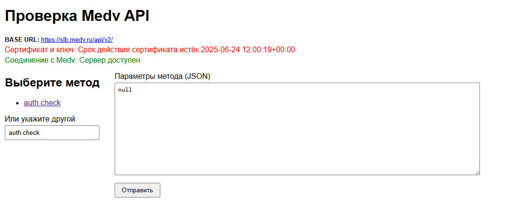

# django-medv

Django-приложение для тестирования API-сервиса https://slb.medv.ru/.



Содержимое:
- `medv-api` - HTTP-клиент для подключения к API и вызова методов
- `django_medv` - Django-приложение, реализующее подключение и проверку API
- `utils` - утилитарные функции

Проект использует менеджер пакетов `uv` для управления зависимостями.

Чувствительные данные хранятся в .env-файле либо в `local_settings.py`, которые исключены из-под контроля версий для безопасности.

Содержимое сертификата и ключа задаются в файле `src/config/settings.py` в виде двух текстовых (str) переменных, которые читаются из файла `.env` либо импортируются из `local_settings.py`.

## Требования
- Python 3.14
- Django >=6.1.1
- uv package manager
- (опционально) gunicorn для деплоя на Linux сервере

## Установка
1. Установите менеджер пакетов `uv`, если ещё не установлен: https://docs.astral.sh/uv/getting-started/installation/
2. Установите зависимости с помощью uv: `uv sync`

## Настройка
### Настройка с помощью переменных окружения
1. Скопируйте `src/.env.example` в `src/.env` и задайте переменную DJANGO_SECRET_KEY.
2. Укажите в файл `src/.env` сертификат и ключ - либо скопируйте их вручную, либо выполните команды (bash):
```bash
printf '\nMEDV_CERT="%s"\n' "$(awk 'BEGIN{ORS="\\n"} {print}' <ПУТЬ ДО СЕРТИФИКАТА>)" >> .env
printf '\nMEDV_KEY="%s"\n' "$(awk 'BEGIN{ORS="\\n"} {print}' <ПУТЬ ДО КЛЮЧА>)" >> .env
```

где путь до сертификата и ключа - это путь до файлов, например `client2026test.crt` и `client2026test.key`.

Переменные `MEDV_CERT` и `MEDV_KEY` в файле `.env` должны быть обрамлены двойными кавычками, каждая строка в переменной должна заканчиваться символом `\n`.

### Настройка с помощью файла настроек
1. Скопируйте `src/config/local_settings.py.example` в `src/config/local_settings.py` и задайте переменную SECRET_KEY.
2. В файл `src/local_settings.py` добавьте переменные MEDV_CERT и MEDV_KEY.

ПРИМЕЧАНИЕ: при чтении настроек приоритет у `local_settings.py`. Если в разных местах указаны разные данные, то сработают те, что в `local_settings.py`.

##  Запуск
1. Проведите миграции `uv run src/manage.py migrage`
2. Запустите `uv run src/manage.py runserver`

## Использование
1. Перейдите по ссылке [http://localhost:8000](http://localhost:8000). Страница не требует аутентификации и авторизации.
2. При загрузке страницы будет проведены проверка доступности сервиса (пинг) и проверка сертификата и ключа. Ошибки будут выведены на страницу.
3. Выберите один из доступных методов API или введите свой. Список доступных методов API:
- auth.check
4. Заполните тело запроса. JSON должен быть валидным.
5. Нажмите кнопку "Отправить"
6. Сервер вернёт ответ, который будет отображён на странице.

## Использованеи через консоль
Приложение содержит management-команду `medv_test` которая вызывается через `uv run src/manage.py medv_test`. Команда реализует следующие шаги:
- проверка доступности сервиса
- проверка валидности ключа и сертификата (проверка должна вернуть ошибку о просроченном сертификате)
- запрос с методом auth.check

## Тесты
Тесты запускаются командой `uv run --directory src manage.py test`
либо
```
cd src
uv run manage.py test
```
## Соответствие требованиям:
> **1. Содержимое(!) сертификата и ключа задаётся в одном из модулей проекта (например, в settings.py) в виде двух текстовых переменных (не в виде путей к файлам).**

Выполнено.

Содержимое сертификата и ключа задаётся в `local_settings.py` либо в .env файле.

> **2. Для всего проекта использовать только стандартную библиотеку языка (помимо пакета django).**

Выполнено:

- для чтения .env используется свой микро-парсер
- для http-запросов используется стандартный модуль urllib. Невозможность использовать MTLS сертификат и ключ в виде строк обходятся путём создания временного файла (здесь может быть риск безопасности)
- для проверки валидности сертификата используется модуль ssl. Ограничение стандартного ssl: он не позволяет определить тип публичного ключа сертификата. Валидная пара с не-RSA сертификатом также может пройти проверку. Диагностика ошибок выполняется корректно

## Следование рекомендациям
> Django-часть: примитивный одностраничный UI, html-форма (имя метода + параметры + submit + отображение результата). 


Выполнено: форма максимально примитивная, одностраничная, все перечисленные данные вводятся пользователем в полях обычной HTML формы.

> Вьюшки желательно CBV. 

Приложение использует class-based view `MedvTestView` и форму `MethodCallForm`

> Несколько доп.тестов будет хорошим бонусом.

Несколько тестов проверяют корректность работы приложения:
- корректность чтения .env
- корректность работы HTTP-клиента (но не доступности сервиса и сертификата/ключа)
- корректность работы django view

Также в клиенте `medv_api` присутутсвуют методы валидации доступности сервиса и сертификата с ключом.

> Реализация части вызова api должна быть похожа на повторно используемый код для вызова любого jsonrpc-метода на любом endpoint с некоторой обработкой ошибок внешнего сервиса и т.д. (в виде отдельного модуля, django-аппа, класса и т.п.)

Клиент для подключения к API реализован как отдельный независимый от django пакет.

Клиент реализует отправку POST-запроса на сервер с уникальным id запроса и обрабатывает ответ сервера (подразумевается стандартный формат JSON RPC сервиса)